# THOCK Frontend

THOCK Frontend는 커스텀 키보드 이커머스 서비스 THOCK의 React 기반 웹 클라이언트입니다.
이 저장소는 THOCK 백엔드 프로젝트가 제공하는 MSA API와 연동해 구매자와 판매자 웹 화면을 구현하기 위한 프론트엔드 전용 레포지토리입니다.
키보드, 스위치, 키캡 상품을 탐색하고 주문할 수 있는 구매자 화면과, 상품 등록 및 판매 수익을 관리하는 판매자 센터를 제공합니다.

본 레포지토리는 원본 팀 프로젝트 레포지토리가 아니며, 팀 프로젝트 종료 후 개인 보관을 위해 개인 계정으로 이관한 저장소입니다.
원본 프론트엔드 레포지토리는 [prgrms-be-adv-devcourse/beadv4_4_Refactoring_FE](https://github.com/prgrms-be-adv-devcourse/beadv4_4_Refactoring_FE)에서 확인할 수 있습니다.

상품 탐색, 장바구니, 주문, Toss Payments 결제, 지갑/입출금 로그, 판매자 상품 관리 흐름이 실제 쇼핑몰 사용 시나리오에 맞춰 구성되어 있습니다.

## 기술 스택

| 영역 | 기술 |
|---|---|
| 프레임워크 | React 19, Vite 7 |
| 라우팅 | React Router DOM 7 |
| API 통신 | Fetch 기반 커스텀 API Client, Vite 개발 프록시 |
| 상태 관리 | React Context, sessionStorage, localStorage |
| UI | CSS, lucide-react |
| 결제 | Toss Payments SDK |
| 이미지 업로드 | ImgBB API |
| 품질 관리 | ESLint |
| 개발 도구 | Antigravity |

## 주요 기능

| 구분 | 기능 |
|---|---|
| 상품 탐색 | 메인 상품 노출, 카테고리 필터, 키워드 검색 |
| 상품 상세 | 상품 이미지, 가격, 할인율, 재고, 수량 선택, 리뷰 작성·조회 |
| 장바구니 | 상품 선택, 선택 삭제, 결제 금액 요약, 주문 이동 |
| 주문·결제 | 주문 상품 확인, 배송지 입력, Toss Payments 결제, 내부 지갑 결제 처리 |
| 마이페이지 | 주문 내역, 주문 상세, 주문 취소, 부분 취소 |
| 지갑 | 사용 가능 잔액 조회, 입출금 로그 조회 |
| 판매자 센터 | 판매 수익 조회, 상품 등록, 상품 수정·삭제, 출금 신청 |

## 서비스 화면

### 메인과 상품 검색

<table>
  <tr>
    <td width="50%">
      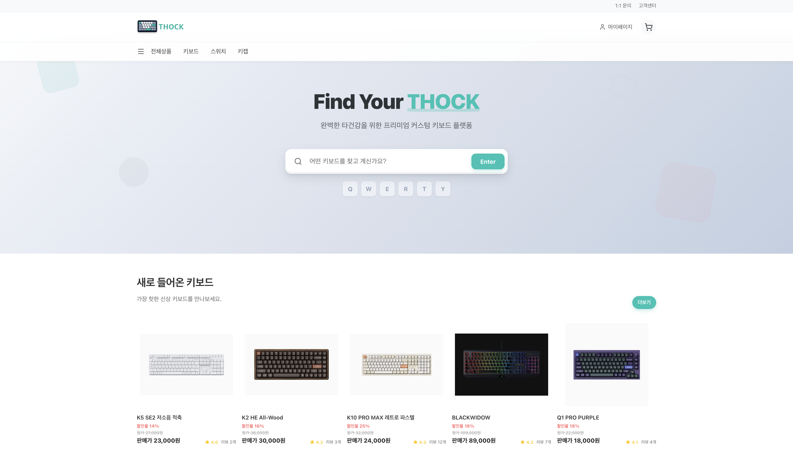
    </td>
    <td width="50%">
      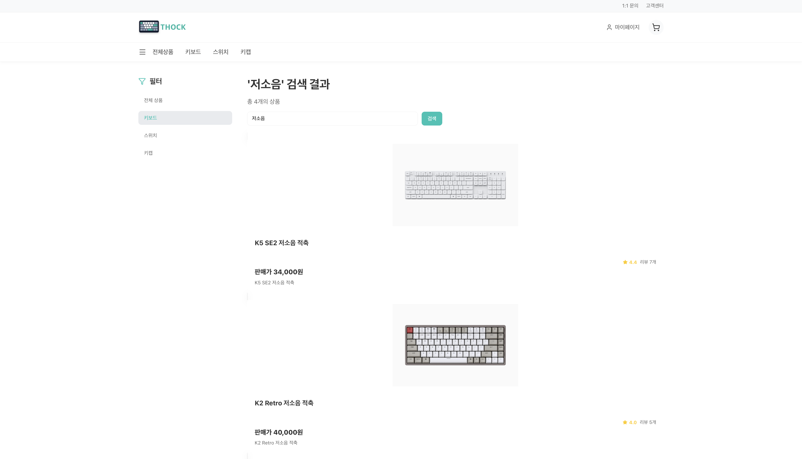
    </td>
  </tr>
  <tr>
    <td align="center">메인 페이지</td>
    <td align="center">검색 결과</td>
  </tr>
</table>

메인 화면은 노출 상품과 검색 진입점을 중심으로 구성되어 있습니다.
검색 화면에서는 카테고리 필터와 키워드 검색 결과가 함께 제공되어 사용자가 원하는 키보드 상품을 빠르게 찾을 수 있습니다.

### 상품 상세와 장바구니

<table>
  <tr>
    <td width="50%">
      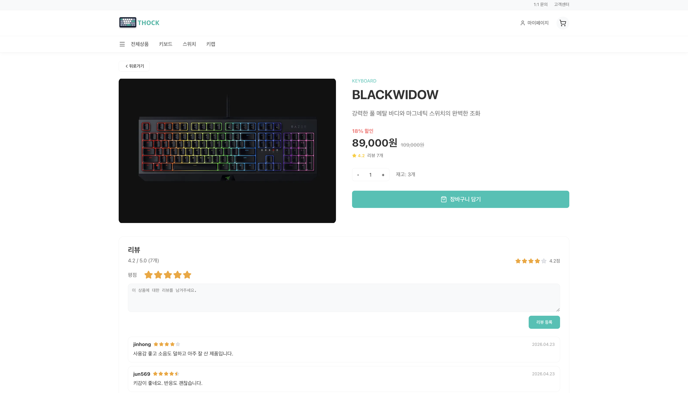
    </td>
    <td width="50%">
      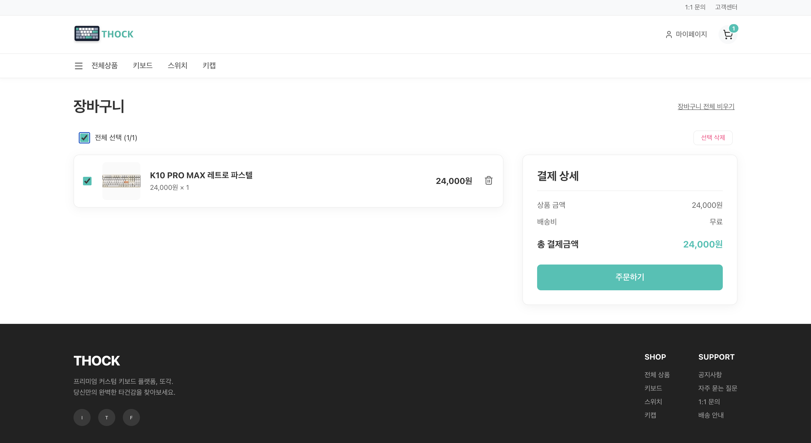
    </td>
  </tr>
  <tr>
    <td align="center">상품 상세</td>
    <td align="center">장바구니</td>
  </tr>
</table>

상품 상세에서는 가격, 할인율, 재고, 리뷰를 확인하고 수량을 선택해 장바구니에 담을 수 있습니다.
장바구니에서는 선택 상품 기준으로 결제 금액을 계산하고, 주문 단계로 이동할 수 있습니다.

### 주문과 결제

<table>
  <tr>
    <td width="50%">
      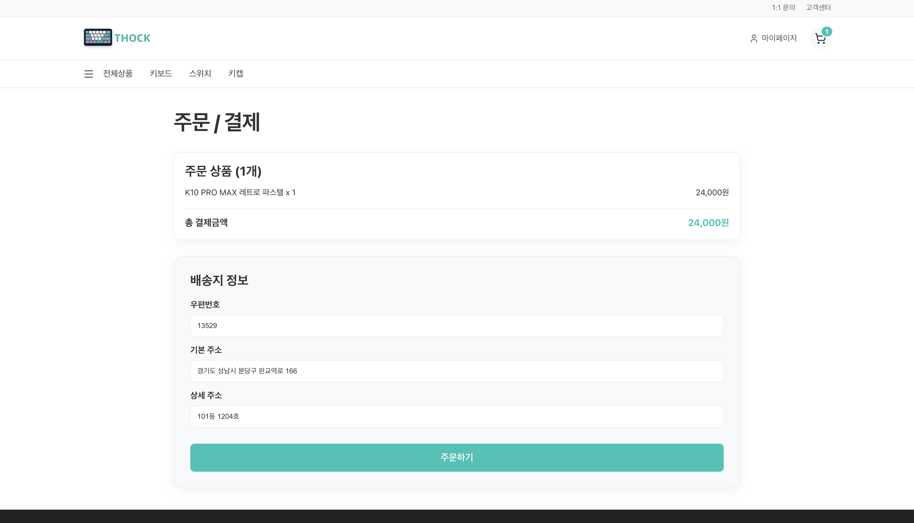
    </td>
    <td width="50%">
      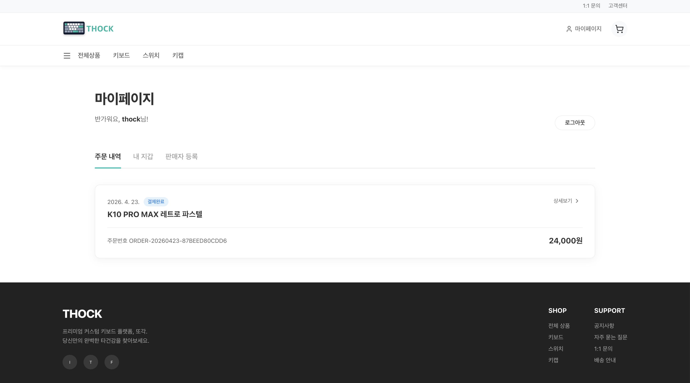
    </td>
  </tr>
  <tr>
    <td align="center">주문·결제</td>
    <td align="center">주문 내역</td>
  </tr>
</table>

주문 화면에서는 상품 금액과 배송지 정보를 확인한 뒤 주문을 생성하고 결제를 진행합니다.
주문 완료 후에는 마이페이지에서 주문 상태, 주문번호, 결제 금액을 확인할 수 있습니다.

### 주문 상세와 지갑

<table>
  <tr>
    <td width="50%">
      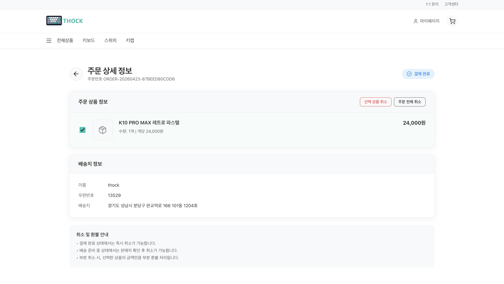
    </td>
    <td width="50%">
      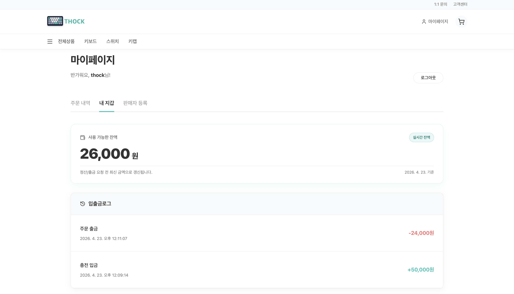
    </td>
  </tr>
  <tr>
    <td align="center">주문 상세</td>
    <td align="center">지갑과 입출금 내역</td>
  </tr>
</table>

주문 상세 화면에서는 주문 상품, 배송지, 결제 상태를 확인하고 주문 취소나 선택 상품 취소를 진행할 수 있습니다.
지갑 화면에서는 사용 가능한 잔액과 입출금 로그를 확인할 수 있어 결제 흐름을 추적할 수 있습니다.

### 판매자 센터

<table>
  <tr>
    <td width="50%">
      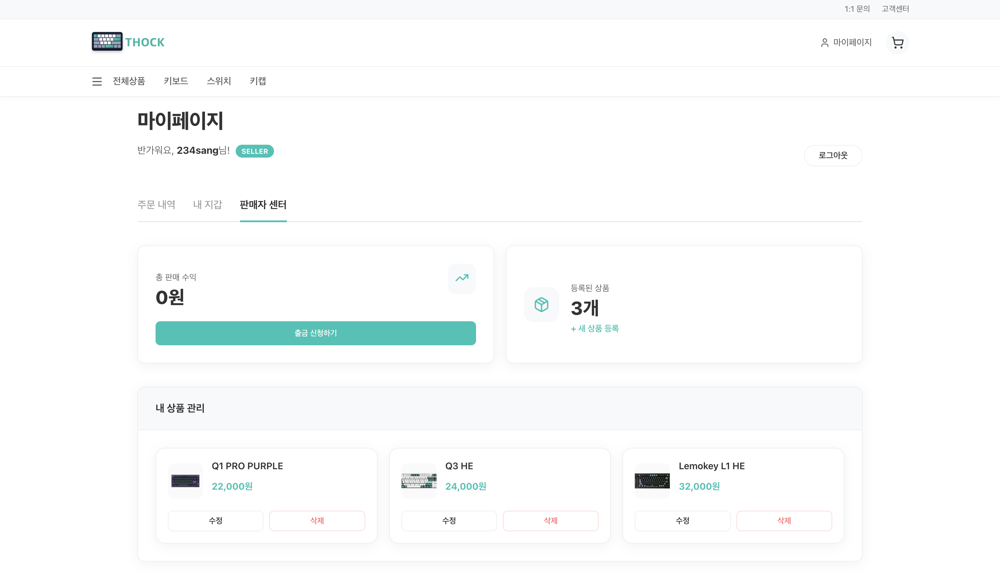
    </td>
    <td width="50%">
      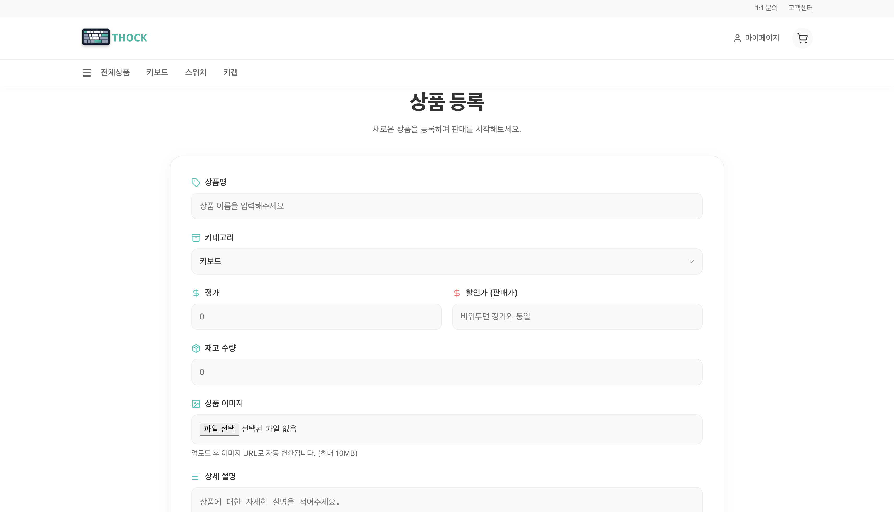
    </td>
  </tr>
  <tr>
    <td align="center">판매자 센터</td>
    <td align="center">상품 등록</td>
  </tr>
</table>

판매자는 판매자 센터에서 판매 수익과 등록 상품 수를 확인하고, 상품을 등록·수정·삭제하거나 출금을 신청할 수 있습니다.
상품 등록 화면에서는 상품명, 카테고리, 가격, 할인가, 재고, 이미지, 상세 설명을 입력하여 판매 상품을 생성할 수 있습니다.

## 사용자 흐름

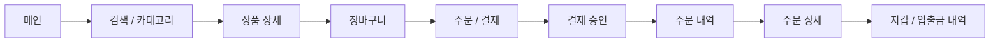

구매 흐름은 상품 탐색에서 시작해 상세 조회, 장바구니, 주문·결제, 주문 내역 확인으로 이어집니다.
결제 이후에는 지갑과 결제 로그에서 잔액 변동 및 결제 이력을 확인할 수 있습니다.

## 판매자 흐름

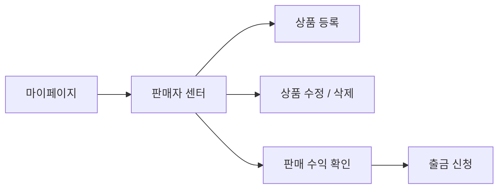

판매자 역할 사용자는 마이페이지의 판매자 센터에서 상품을 등록하고, 등록된 상품을 관리하며 판매 수익과 출금 가능 금액을 확인할 수 있습니다.

## 백엔드 연동 범위

| 영역 | 연동 내용 |
|---|---|
| 회원 | 로그인 사용자 정보, 마이페이지 사용자 상태 |
| 상품 | 상품 목록, 검색, 상세 조회, 상품 등록·수정·삭제 |
| 장바구니 | 장바구니 추가, 선택 조회, 삭제, 주문 이동 |
| 주문 | 주문 생성, 주문 내역 조회, 주문 상세 조회, 취소 |
| 결제·지갑 | Toss 결제 승인, 내부 지갑 결제 처리, 잔액 조회, 입출금 로그 조회 |
| 리뷰 | 상품 리뷰 조회와 등록 |
| 정산 | 판매 수익, 월별/일별 정산 내역 조회 |

## 프로젝트 구조

```text
frontend
├── images/frontend        # README 및 문서용 서비스 화면 이미지
├── public                 # 정적 리소스
├── src
│   ├── components         # 공통 레이아웃, 헤더, 푸터, 결제 모달
│   ├── contexts           # 인증, 장바구니 Context
│   ├── pages              # 라우트 단위 페이지
│   ├── services/api       # 도메인별 API 모듈
│   ├── services/apiClient.js
│   └── utils              # 가격 계산 등 공통 유틸
├── vite.config.js         # Vite 설정 및 개발 프록시
└── vercel.json            # SPA 라우팅 rewrite 설정
```

## 환경 변수

민감한 키 값은 저장소에 커밋하지 않고 `.env.local` 등 로컬 환경 파일에 설정합니다.

| 변수 | 설명 | 필수 여부 |
|---|---|---|
| `VITE_TOSS_CLIENT_KEY` | Toss Payments 클라이언트 키 | 결제 테스트 시 필수 |
| `VITE_IMGBB_API_KEY` | 판매자 상품 이미지 업로드용 ImgBB API 키 | 상품 등록 이미지 업로드 시 필수 |
| `VITE_API_BASE_URL` | 배포 환경에서 사용할 API 서버 주소 | 배포 환경에서 권장 |
| `VITE_USE_MOCK_REVIEW_API` | 리뷰 API mock 사용 여부. `false`면 실제 API 호출 | 선택 |

예시 파일을 복사한 뒤 로컬 값으로 수정합니다.

```bash
cp .env.example .env.local
```

`.env.local` 예시:

```bash
VITE_TOSS_CLIENT_KEY=your_toss_client_key
VITE_IMGBB_API_KEY=your_imgbb_api_key
VITE_API_BASE_URL=https://api.thock.site
VITE_USE_MOCK_REVIEW_API=false
```

로컬 개발 환경에서는 `/api` 요청이 `vite.config.js`의 프록시 설정을 통해 `http://localhost:8080`으로 전달됩니다.
로컬 API Gateway 주소를 바꾸려면 `vite.config.js`의 `server.proxy['/api'].target` 값을 수정합니다.

## 실행 방법

Node.js `20.19+` 또는 `22.12+` 버전을 권장합니다.

```bash
npm install
npm run dev
```

개발 서버가 실행되면 브라우저에서 아래 주소로 접속합니다.

```text
http://localhost:5173
```

백엔드 API Gateway를 기준으로 요청을 보내며, 로컬 개발 시에는 백엔드 Docker Compose 환경을 먼저 실행한 뒤 프론트 개발 서버를 실행합니다.

## NPM Scripts

| 명령어 | 설명 |
|---|---|
| `npm run dev` | Vite 개발 서버 실행 |
| `npm run build` | 프로덕션 빌드 생성 |
| `npm run preview` | 빌드 결과 로컬 미리보기 |
| `npm run lint` | ESLint 검사 |

## 프로젝트 특징

- 구매자와 판매자 역할을 모두 고려한 이커머스 화면으로 구성되어 있습니다.
- 상품 탐색부터 주문, 결제, 지갑 로그까지 실제 구매 흐름이 연결되어 있습니다.
- 백엔드의 주문, 결제, 재고, 취소 흐름을 프론트 화면에서 검증할 수 있도록 장바구니, 주문 내역, 주문 상세, 입출금 내역 화면이 구성되어 있습니다.
- 판매자 센터를 통해 상품 등록, 상품 관리, 판매 수익 조회, 출금 신청이 지원되며, 단순 조회형 쇼핑몰이 아닌 운영 흐름까지 고려되어 있습니다.
- Vite 프록시와 배포 환경 API 주소가 분리되어 로컬 개발과 배포 환경에 모두 대응할 수 있습니다.
